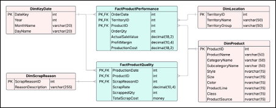
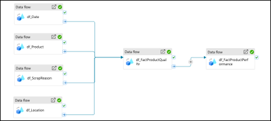

# Product Analytics & Data-Driven Strategy

End-to-end data engineering and analytics project using Azure Data Factory and SQL

📁 SQL queries used in this analysis are available in the `/sql` folder.

## Overview

This project uses data warehousing and SQL analytics to support product development decisions for Adventure Works.

The focus is to identify high-performing products, uncover cost inefficiencies, and improve profitability through data-driven insights.

## Data Architecture

A star schema data warehouse was designed to integrate product, sales, and quality data into a structured model for analysis.

## ETL Pipeline

An automated ETL pipeline was built using Azure Data Factory to extract, transform, and load data from multiple sources into the data warehouse.

## Key Analysis Areas

### Profitability Analysis
- Compared production cost and profit across product categories  
- Identified high-cost products with low returns  
- Evaluated in-house vs outsourced production performance  

🔗 [View SQL](./sql/profitability-analysis.sql)

### Regional Performance
- Analysed sales and profit distribution across regions  
- Identified regions with strong revenue but weak profitability  
- Highlighted opportunities for pricing and inventory optimisation  

🔗 [View SQL](./sql/regional-performance.sql)

### Product Configuration Analysis
- Evaluated performance across product variations (color, style, type)  
- Identified customer preferences and underperforming configurations  
- Supported product portfolio optimisation decisions  

🔗 [View SQL](./sql/product-configuration.sql)

### Scrap & Quality Analysis
- Analysed scrap cost and defect patterns across products  
- Identified manufacturing and operational inefficiencies  
- Highlighted key drivers of hidden production costs  

🔗 [View SQL](./sql/scrap-analysis.sql)

## Key Insights

- High production cost does not always lead to high profitability  
- Product performance varies significantly across regions and configurations  
- Scrap waste is a critical but often hidden cost driver  
- Data-driven analysis supports more effective product and operational decisions  

## My Contribution

This project was completed as part of a group case study. My contribution focused on:

- data warehouse schema design (star schema)  
- supporting ETL processes using Azure Data Factory and SQL  
- data modelling and analytical interpretation  
- identifying business insights to support product and operational decisions   
